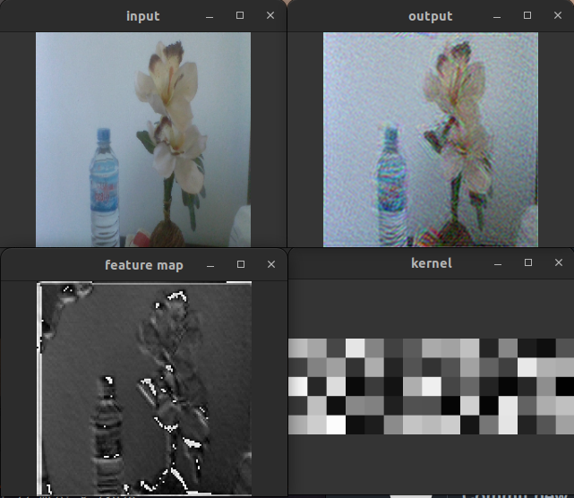

# AutoEncoder FFT

A cuda implementation of a convolutional autoencoder which can operate in both standard coordinate space and momentum space.

Training of the network by backpropagation can also be performed in both standard coordinate space and momentum space 
(and due to the simplicity of convolution in momentum space, it turns out to be much faster when operating in such configuration).

The input is configured to be the real time feed from the camera (accessed through opencv), but can be modified to be a image or video file by tweaking 
the file [autoencoder.cpp](./source/autoencoder.cpp).

Output is the recostructed image produced by the autoencoder (which once trained should reproduce the input). 
Also shown are the learned kernels for each layer and the corresponding feature maps that they produce (only available in coordinate space).

Convolutional layers can be added/removed during execution and weights saved/loaded.

Various configuration parameters can also be adjusted in real time: 
- learning rate
- use of active learning rate
- use of symmetric weights shared between encoder and decoder
- use of multiobjective optimization to maximaze the difference between the learned kernels

## Installation

The program requires opencv and cuda toolkit to run. 

On Ubuntu 22.04, the script [install_dependencies.sh](./install_dependencies.sh) can be used to install opencv4 and cuda/cuda toolkit 11.7

To compile run `make`. 

Note that it could be necessary to modify the [Makefile](./Makefile) to point to the correct libraries paths.

## Usage

To run the program run the command `./AutoEnc`

Following is the list of commands / options:

| Command        | Action        |
| ------------- |--------------|
|1 | Start/Stop backpropagation|
|2 | Increase the scale of the backpropagation input|
|3 | Decrease the scale of the backpropagation input|
|4 | Increase the learning rate|
|5 | Decrease the learning rate|
|6 | Increase inertia value (Not av in  FFT)|
|7 | Decrease inertia value (Not av in  FFT)|
|9 | Switch active learning rate on and off (Not av in  FFT)|
|0 | Switch gpu processing on and off (0=off, 1=on)|
|f | Switch  FFT processing on and off (i.e. convolution and backpropagation in momentum space)|
|g | Perform inverse  FFT on each layer (useful to visualize the feature maps in momentum space)|
|q | itearate (forward) throught the feature maps of each layer|
|w | itearate (backward) throught the feature maps of each layer|
|m | Switch multiobjective optimization on and off|
|z | itearate (forward) throught the network layers|
|x | itearate (backward) throught the network layers|
|e | Initialize random weights on the selected layer |
|c | Clean  FFT convolutional kernels vector|
|p | Activate/deactivate symmetric weights|
|s | Save convolutional weights|
|l | Load convolutional weights|
|n | Add new convolutional layer (the parameters of the layer are set in the file [New_Layer_Param.txt](./New_Layer_Param.txt))|
|d | Delete last/most internal layer|
|i | Print network structure|
|Esc | Quit|

